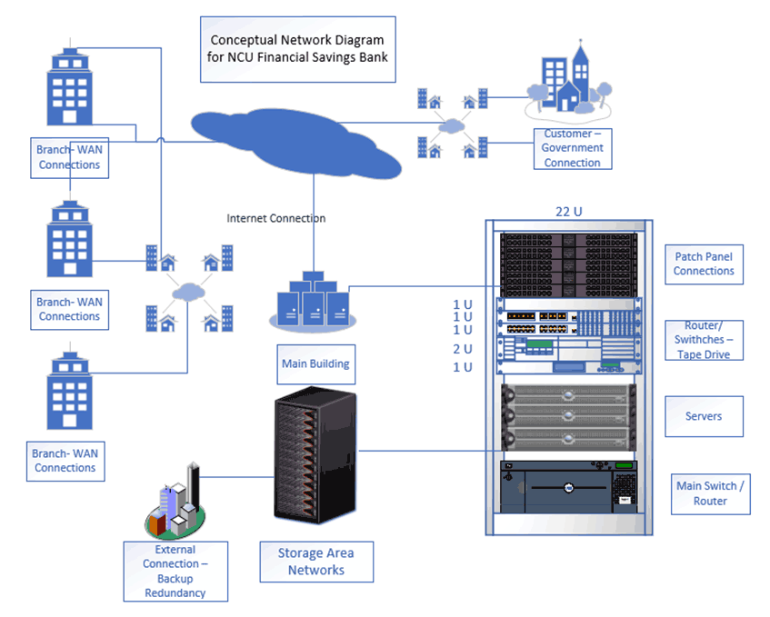

# Analyze Potential Cybersecurity Risks

## Scenario

You are the information security manager (ISM) of a financial and savings organization (NCU Financial Savings Bank, or NCU-FSB) with a clientele base of 250,000 customers averaging 1.2 million transactions per week. The IT infrastructure consists of 10 servers for each of the three locations: five for local production and five for replication and redundancy. After a recent vulnerability assessment performed by an external firm, specific threats and vulnerabilities were identified and needed to be addressed. The conceptual network diagram for NCU-FSB is displayed in Figure 3.

The following findings were reported:

- MAC address conflicts that need to be resolved between telecommunications and network appliances (routers, switches, firewalls, servers, etc...)
- Security warnings coming from the proxy and email servers
- Constant firewall alerts classified as high
- Employee collusion in certain processes that can result in a significant financial loss to the organization
- Inconsistencies in data transmissions
- Attacks detected from external international sources caused by multiple critical servers that have been compromised due to vulnerabilities in the operating system, where the presence of additional services, opened ports, additional dynamic link libraries (DLLs), additional files and scripts added to the system partitions, and critical data missing from the server issues were detected
- As the newly hired ISM of the organization, you have been tasked by the board of directors to analyze and layout a strategy to address risk issues and what aspects or areas should be considered when performing a security risk assessment. One of the first observations is the lack of segregation of duties (SOD) to reduce any collusion, but you recognize this could lead to an increase in the number of employees within your team. Budgetary constraints are against the addition of employees in your department.

## Instructions

For this assignment, you must write a two-column, two-page journal article presenting the results of your analysis and initial data discovery (eDiscovery) in which you briefly answer the following questions:

- What solutions can you employ to reduce or even eliminate the possibility of collusion in the financial organization?
- How would you address the need to segregate duties (SOD) and rotate tasks, for it is a requirement by laws applicable to financial and savings institutions like Sarbanes Oxley (SOX) and Gramm Leach Bliley Act (GLBA)?
- What actions or changes in server setting and configuration must be made to avoid MAC address collision and server compromise?
A template for the journal formatting is available in the weekly resources. Be sure to set all margins to 1-inch. Use single spacing and 12-point Times New Roman font.

## Your article must also include the following

- An introduction that addresses the essence of a security risk assessment. In this introduction, you will explain and defend the importance of having a risk management program in place, the main elements of a risk program, and the benefits derived from incorporating this strategy as part of the corporate security program.
- Discussion of the primary threats enterprises are currently facing, the impact, and a comprehensive analysis of how security must address these threats, attacks, and vulnerabilities.
- Different regulatory requirements that warrant a security risk analysis.
- Taxonomy of risk elements for cyber-risk management as part of the security risk analysis. Define the concept of taxonomy and its importance as part of the risk assessment and management process. Develop a table and relation diagram.
- Information needed to initiate a security risk analysis—eDiscovery process flowchart and explanation.

## Standard Requirements

A minimum of 3 scholarly references listed at the bottom of the paper.
Length: two-column, two-page journal article

The completed assignment should demonstrate thoughtful consideration of the ideas and concepts that are presented in the course and provide new thoughts and insights relating directly to this topic. Your response should reflect graduate-level writing. Be sure to adhere to Northcentral University's Academic Integrity Policy.

Upload your document and click the Submit to Dropbox button.
