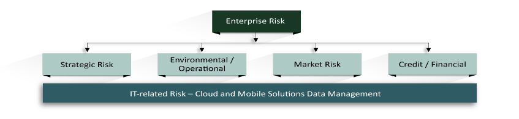

# Risk Assessment and Information Discovery

An information system is defined as the integrated and coordinated combination of strategic, tactical, and operational plans supported by information technology (hardware, software, databases, telecommunications, and tools) in order to process data and operations to deliver an expected result or product. The evolution of information technology has been remarkable in the last three decades, transcending from a service department that processed data through applications and produced reports delivered to operations, to be the heart or spinal cord of the production and service chain.

In order to effectively support corporate or organizational strategic plans, a sound and integrated corporate risk management strategy and plan must be developed as part of the corporate security strategy. Key elements like defining and contextualizing terms and functions, categorizing or classifying risks and threats—depending on the impact to operations—must be defined and measured. Threats must be discovered, and the level of risks each pose to the normal course of operations be measured and controlled, as risks are never completely eliminated or removed. As controls and corrective actions are implemented, documenting these is essential and required by law, depending on the nature of the products or services of the organization. In this course, you will develop these strategies and plans for a secure and risk-controlled environment.

The nature of the threat landscape is evolving, while the underlying technology platforms that hold sensitive data are also changing. Determining threat motivations, threat capabilities, ease of exploitation, and existing countermeasures are imperative. Risk management, as defined within the context of information security, is the processes or tasks performed for identifying, assessing, analyzing, and controlling threats by mitigation, avoidance, or elimination of known and identified threats. With this assessment and control structured identified, management must then decide which control structures are to be authorized for implementation. The purpose of risk management is to assist management in prioritizing how to protect assets based on the impact the loss of those assets would have on the organization.

Risk assessment must be a top-level management priority to ensure transparent, reliable, and secure operations and data assurance. This process occurs at multiple levels of an organization with a focus on different areas, depending on the nature of the organization. In the development and implementation of risk assessment and management strategies, different roles are involved, and each has a specific function to perform. It is the executive or higher management’s responsibility to approve the risk management strategies as part of the corporate security strategy and to manage the management of business risk.

The chief financial officer (CFO) must ensure that the organization’s capital earnings are protected and controlled, as well as the integrity of financial applications and transactions. The chief technology officer (CTO) or chief information officer (CIO)must focus on technology risks and protect the information technology perimeter and IT operations, the chief information security officer (CISO) must address security risks (physical, logical, transactional), and auditors evaluate the efficiency of the risk management strategy and validate the precision and effectiveness of control risks.

To successfully manage and control risks, vulnerabilities, and threats must first be identified, categorized, and analyzed before deciding on the suitable control to implement as mitigation. Threats are the intent or action aimed at causing harm. Vulnerabilities are any exposure and known or unknown weakness in IS nodes, devices, software, or data that—if identified—become threats that can be exploited to cause harm to systems, data, and operations.

One of the initial exercises performed as part of this identification and categorization process is initial digital discovery and taxonomy of cyber-risk. Taxonomy is the process of defining, naming, and classifying objects processes or items (a convention of biological diversity). The taxonomy of operational cyber-risks looks to identify, organize, and classify all resources and sources of data and processes that the cyber-risk function must assess and manage—from people issues; hardware-software failures; gaps, faults, or holes in organizational processes; inventory of processes, databases, and applications running as part of the operation or service chain; and external events or activities.

In data management, taxonomy represents all the data elements or attributes, and their characteristics and relations within a domain (Knight, 2017). It is important to discover and classify all processes, applications, databases, and connections running in the enterprise to effectively implement and manage a cyber-risk and management program. Diagraming a taxonomy of possible sources of risks serves as a basis to define and implement the necessary controls, appliances, and tools needed to protect the perimeter of systems and applications—making the systems reliable and secure in support of corporate processes and operations. With this structure, a business definition or business dictionary of risks is also created. A sample taxonomy is shown below:

As part of the corporate security program, there are mandated control structures that have been established and are required by law. Some of the regulations that include requirements for information technology control measures are:

* Sarbanes Oxley Act (SOX) of 2002
* Gramm Leach Bliley Act (GLBA)
* Health Insurance and Portability and Accountability Act (HIPAA)
* Health Information Technology for Economic and Clinical Health Act of 2009 (HITECH)
* Family Educational Rights and Privacy Act of 1974 (FERPA)
* Payment Card Industry Data Security Standard (PCI)
* Federal Information Security Management Act of 2002 (FISMA)
* General Data Protection Regulation Act of 2018 (GDPR).  

## Signature Assignment Preview

The culminating signature assignment (due in Week 8) requires you to design a corporate risk management and response strategy. To ensure you are prepared and have adequate time to complete this assignment, please review the instructions by looking ahead in the course. Contact your professor if you have questions.

Review the weekly resources to prepare for this week’s assignments. The resources may include textbook reading assignments, journal articles, websites, links to tools or software, videos, handouts, rubrics, etc.

## References

Knight, M. (2017). What is taxonomy? Dataversity.
