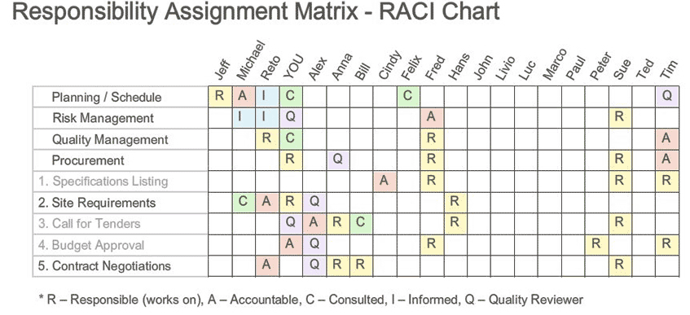

# Risk Reduction Techniques for Perimeter Protection

This week, you will study the tools and technologies available to identify and define a proper risk management plan.

A business asset—like people, data, processes, and technologies—is anything that has value to a company or organization. If the asset has value, often expressed or estimated in monetary value, potential damage or loss will result in economic loss to the company as well (Gibson, 2015). These assets need to be classified and inserted in the taxonomy of risks and the risk register. Any occurrence of risk will also need to be logged in the risk register.

A business asset has two major classifications: tangible and intangible. A tangible asset is an asset that is mostly physical in nature and has a specific cost and estimated value—such as products, plants, buildings and offices, vehicles, human resources, equipment, networks, applications, data, and even services (descriptions and price lists), among others. An intangible asset is not physical and cannot be directly assigned monetary value; but losing it can harm the company as well—such as image, brand name, brand value, or customer trust, among others.

When it comes to information technology, there are certain areas—or domains—where risk must be categorized or classified and manage to effectively control and mitigate risk. These domains are:

- [Security and Risk Domains](https://ncuone.ncu.edu/shared/Course%20Interactives/ST/TIM-5030/week_02_Security_Risk_Domains/index.html)

All these domains must initially be properly documented and managed to be able to implement preventive control measures and proactively identify and address potential risks that can result in damage or disruption to the normal state of operations.

One control structure that is required by some of these rulings—like SOX, GLBA, and HIPAA—is the concept of segregation of duties. Segregation of duties (SOD) is an internal control practice where the steps or tasks performed in a process flow are dispersed or distributed to more than one person or department (AICPA, 2018). This practice can be combined with mandatory vacations and job rotation, both as a measure for contingency and business continuity, and to prevent and detect potential irregularities or even fraud. However, these rotations must be performed exercising the least-known or need-to-know privilege, where each employee or business function must have access only to the data, applications, or functions needed to perform a process, function, or job. These strategies or concepts form the basis of what is known as the defense-in-depth strategy.

One tool that can be used to institute and manage SOD, employee rotation, and mandatory vacations—and that can be shared by human resources (HR), business units or departments, information systems department, and security—is the RACI chart for projects. The RACI (responsible, accountable, consulted, informed) chart is a matrix that describes all tasks and functions to be carried out during project execution but can also be used for processes, transactions, and operations to grant the necessary access levels. This matrix is also called the role-based authorization matrix.



Figure 4. Sample RACI (responsible, accountable, consulted, informed) user profile chart – Image licensed under creative commons license

The controls (or countermeasures) used to mitigate risks are commonly known as inherent and residual controls. They are used to prevent and control threats that can cause losses to business and operations disruptions.

There are three types of risk from the security and control standpoint:

1. Inherent Risk: This is the possibility of incorrectly identifying a risk leading to the implementation of inaccurate controls. This risk type can also be defined as a risk that could not be protected or detected by the entity’s internal control.
2. Control Risk: Also known as an internal control risk, this risk may not be detected by the current risk detection and prevention mechanisms and could impact results to be inconsistent or misleading (Wiki Accounting, n.d.).
3. Detection Risk: This is when an auditor fails to detect faulty control, threat, or vulnerability; this is also known as an audit risk.

```text
Risks = Inherent Risk x Control Risk x Deletion Risk
```

Based on these types of risks, the risk model can be calculated as:

To implement a control structure, there are two possible options to resolve or control risk:

1. Inherent Control – Those controls applied to mitigate or control risk.
2. Residual Control – This happens when management chooses not to implement the recommended controls for operational or strategic reasons. However, the fact that no control is implemented does not mean that the threat, vulnerability, or risk is not controlled; monitoring controls are put in place to constantly follow and measure the risk. If the risk escalates, then the decision of not implementing controls could be overturned.

The risks need to be classified and logged to keep a list of known risks and how they were mitigated or controlled. A risk matrix consists of the severity levels classification of the probability of an incident to occur and the impact it will have on operations or service chain.

One common practice to identify risks is to classify them based on risk levels. Before risks can be assessed and classified, categories of risk must be defined depending on the nature of operations. This process of categorization defines levels of severity based on the likelihood of occurrence.

Review the resources listed below (and previously provided resources, as needed) to prepare for this week’s assignments. The resources may include textbook reading assignments, journal articles, websites, links to tools or software, videos, handouts, rubrics, etc.

## References

3 Types of Audit Risk Definitions. (n.d.) Wiki Accounting online.

American Institute of Certified Public Accountants (AICPA). (n.d.) Segregation of duties.

Mason, J. (2017). VPN – A beginner’s guide. The Best VPN.

National Institute for Standards and Technology (NIST). (2018). Risk management framework for information systems and organizations – A system lifecycle approach for security & privacy. NIST Special Publication 800-37 Rev. 2. National Institute of Standards and Technology.
