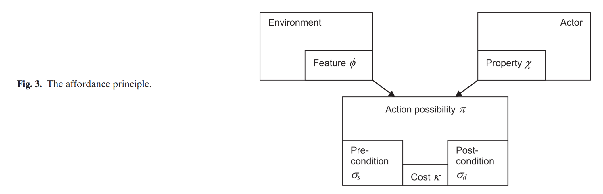

# Readings

## Analysis of Affordance, Time, and Adaptation in the Assessment of Industrial Control System Cybersecurity Risk (2017)

Busby JS, Green B, Hutchison D. Analysis of Affordance, Time, and Adaptation in the Assessment of Industrial Control System Cybersecurity Risk. Risk Analysis: An International Journal. 2017;37(7):1298-1314. [https://doi-org.proxy1.ncu.edu/10.1111/risa.12681](https://doi-org.proxy1.ncu.edu/10.1111/risa.12681). Accessed June 9, 2020. [AnalysisAffordanceControlSystem.pdf](AnalysisAffordanceControlSystem.pdf).

> More generally, any attempt to intervene in a complex adaptive system, in order to control risk, is likely to produce an unexpected and perhaps self-defeating response.

The authors provide several examples of how people adapt to protections by finding strategies that lead to a path of least resistence.  For instance, longer passwords are written down, and complex processes to report issues discourages people speaking up.  This results in a competition between (adversaries, maximizing risk) vs (legitimate users, maintaining convienence) vs (risk managers, minimizing risk).

### How do they model these competing relationships

Their approach to optimizing this triangle is focuses on the time to exploitation/process by pass via:

1. Develop a graph of attack affordances

2. Find spanning path of minimum duration

3. Find probabilities of other critical probabilities

4. Determine acceptability of the minimum path

5. Split the risk into acceptable and unacceptable buckets, continue addressing unacceptable items

6. Identify additional controls on minimum path

7. Predict affordance to change

8. Anticipate ramifications of the graph

9. Iterate back to step (2)

### What is the affordance principal

The authors use the afforance principal to determine the likeihood that an edge is traversed through the attack graph.  After weighting all transitions (e.g., via Markov process), the shortest path is calculated.  While the attacker might not take the shortest path, it can be proven (upto the quality of underlying heuristic) that adequite protection of the shortest path requires adequite protection of all longer paths.  However, minor changes in the calculation process can shift which path becomes the shortest path.  The author mitigate this by using the probability that a path is the shortest path, instead of a specific instance.

For example, if an attacker wants to break into your house, breaking the window is equally effective and cheaper than driving a car into the front door.  All parties desire the path of least resistence, and escalation is only necessary when trivial attacks are unsuccessful.  Similar scenarios exist for legitimate users, such as lengthy processes to login to their computer results in longer session durations.

## Components and challenges of integrated cyber risk management (2015)

Kosub T. Components and challenges of integrated cyber risk management. Zeitschrift für die gesamte Versicherungswissenschaft. 2015;104(5):615. [https://doi.org/10.1007/s12297-015-0316-8](https://doi.org/10.1007/s12297-015-0316-8). Accessed June 9, 2020. [ComponentsChallengesIntegration.pdf](ComponentsChallengesIntegration.pdf).

This journal discusses the ISO/27000 risk management philosophy and some of the challenges with that it tries to solve.  Generally speaking, businesses are not very good at assessing the risk that comes from either `cyber risk and cyber crimes`.  These are two distinct categories of issues and both can result in significant loss of productivity, monetary resources, and public relations.

Similar to other papers, the notion of risk transference, avoidance, and acceptance -- as a mechanism for living with undue risk.  They also lay out the case for a business continuity strategy that includes an `IT contingency` ammendment for when things get really. 

## Cyber Gurus': A rhetorical analysis of the language of cybersecurity specialists and the implications for security policy and critical infrastructure protection (2015)

Quigley, K., Burns, C., & Stallard, K. (2015). ‘Cyber Gurus': A rhetorical analysis of the language of cybersecurity specialists and the implications for security policy and critical infrastructure protection. Government Information Quarterly Volume 32, Issue 2, April 2015, Pages 108-117. [https://doi.org/10.1016/j.giq.2015.02.001](https://doi.org/10.1016/j.giq.2015.02.001). [CyberGurusLanguage.pdf](CyberGurusLanguage.pdf).

This article was reviewed during [TIM-8301 Week5](https://github.com/dr-natetorious/TIM-8301-Principals_of_CyberSecurity/blob/master/Week5_AppraiseRisk/Readings/README.md#cyber-gurus-a-rhetorical-analysis-of-the-language-of-cybersecurity-specialists-and-the-implications-for-security-policy-and-critical-infrastructure-protection-2015) and discusses the stylistic choices that authors use to sounds intelligent or increase the chances of click-bait.

## COBIT Helps Organizations Meet Performance and Compliance Requirements (2015)

Radhakrishnan, S. (2015). COBIT Helps Organizations Meet Performance and Compliance Requirements. COBIT Focus, 1–5. [https://search-ebscohost-com.proxy1.ncu.edu/login.aspx?direct=true&db=bth&AN=102026122&site=eds-live](https://search-ebscohost-com.proxy1.ncu.edu/login.aspx?direct=true&db=bth&AN=102026122&site=eds-live). [COBIT_Helps_Orgs.pdf](COBIT_Helps_Orgs.pdf).

The authors describe how COBIT works with any organizational structure because it is a collection of indstury best practices (see [TIM-8301 Week5](https://github.com/dr-natetorious/TIM-8301-Principals_of_CyberSecurity/blob/master/Week5_AppraiseRisk/Readings/README.md#towards-a-theoretical-foundation-of-it-governance---the-cobit-5-case-2015) for additional info).  They compare various other frameworks like program management and IT risk management to show how the ideas are easily map between systems. 

## How to Protect Critical Infrastructure From Hackers (2015)

Virgillito, D. (2015). How to Protect Critical Infrastructure From Hackers. CIO Insight, 1. [https://search-ebscohost-com.proxy1.ncu.edu/login.aspx?direct=true&db=bth&AN=103356879&site=eds-live](https://search-ebscohost-com.proxy1.ncu.edu/login.aspx?direct=true&db=bth&AN=103356879&site=eds-live). [ProtectCriticalInfra.pdf](ProtectCriticalInfra.pdf).

The authors propose a roadmap to Enterprise Security Management (ESM) that introduces base systems like

- Patch Management
- Threat modeling
- Architectual Principals
- Risk Management
- Mobile Safety
- Software Defined Networking and IoT

## ASSESSING AND RE-SETTING CULTURE IN ENTERPRISE RISK MANAGEMENT (2018)

WESTON, H., CONKLIN, T. A., & DROBNIS, K. (2018). Assessing and Re-Setting Culture in Enterprise Risk Management. Assurances et Gestion Des Risques, 85(1/2), 131–166. [https://doi-org.proxy1.ncu.edu/10.7202/1051319ar](https://doi-org.proxy1.ncu.edu/10.7202/1051319ar). [AssessCulture.pdf](AssessCulture.pdf).

The authors discuss the need to target organizational culture when making changes to the process and protections.  When culture does not change is results in compliance with the specific policy, nothing more and nothing less.  Enterprise Risk management as a field has historically neglected the necessity of cultural changes and this has led to numerous failed programs.

> Culture is "a set of basic assumptions that defines for us what to pay attention to, what things mean, how to react emotionally to what is going on, and what actions to take in various kinds of situations" (Schein, 2004, p. 31-32). It is the "underlying, unquestioned - but virtually forgotten - reasons for the way we do things here" (Ott, 1989, p 3). [...] The purpose of culture is to "create order, meaning, cohesion and orientation, thus making collective action, indeed organizational life, possible."

### How can we create change in organizational culture

We provide a brief review of the steps here with more inclusive descriptions and applications below (pg. 144).

1. Establish a sense of urgency. A crisis mentality is at the heart of this step where organizational members feel imminent corporate demise if something is not done. A major loss to the company, however that is defined or interpreted, creates that sense of urgency.
2. Form a powerful coalition of powerful people at the top of an organization who champion and support the change initiative.
3. Create a compelling vision of the future that is easy to communicate and appeals to stakeholders of all stripes.
4. Communicate the vision. There must be an enormous amount of credible communication of this vision to capture the hearts and imaginations of staff at all levels.
5. Empower others to act on the vision. This often requires that organizations restructure systems, processes, and practices of the culture that may block the new behaviors to associate with the new vision. Managers must also encourage through the new systems, processes, and practices the desired behaviors that underpin the new culture.
6. Establish processes to celebrate short-term wins by identifying moments and events so staff see progress towards the ultimate goal of transformation.
7. Consolidate improvements and establish processes to continue the change towards the new behaviors and practices that ultimately form the culture. The momentum of the short-term wins can serve as an impetus for continued change in the processes and practices that will cement these changes into the cultural fabric of the organization.
8.  Establish the changes as the fundamental scaffolding in the organization's culture and institutional icons. Change to the new culture is successful when members say this is "the way we do things around here" (Kotter, 1995, p. 67). This is most likely when there is a clear understanding of how these changes have led to the firm's success.
