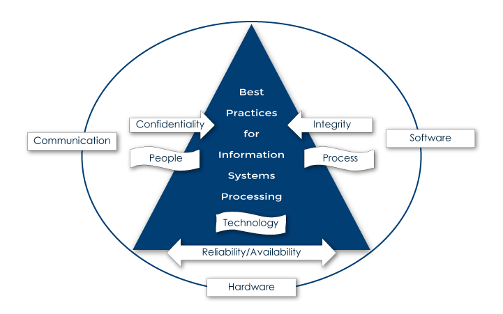

# Information Security Governance

An enterprise security governance program consists primarily of a set of rules, procedures, and standards that a company implements and manages as part of the corporate security strategy. The purpose is to reduce risk caused by threats and vulnerabilities and to enact the assurance programs to ensure a reliable security information technology landscape in compliance with applicable laws and regulations.

Best Practices for Information Systems Processing:
- Confidentiality
- Integrity
- Communication
- Software
- People
- Process
- Technology
- Reliability/Availability
- Hardware

Figure 5. Critical Elements for Information Systems Processing Best Practices. Fonseca, S. (2009)

Some common issues most IT departments have faced or are dealing with are:

- Lack of or outdated standards, policies, and procedures for security management, proper computer use, and data management by all users of the enterprise. These standard operating procedures (SOPs) must be approved by a higher executive level and communicated to all users of systems and applications
- Lack of logical access structure for servers and database management
- Unrestricted access to computer and server room or wiring closets
- Standards and procedures for proper systems access requests and configuration process
- Deficiencies in patch management, change management, or system update procedures
- Gaps in IT architecture and telecommunications update and synchronization services
- Absence or inconsistent system security program, risk assessment, and incident handling procedures
- Deficiencies in cabling structures and wiring closets identification standards
- Lack of or outdated antivirus, intrusion detection, intrusion prevention, and malware software, and monitoring practices
- Improper or missing network and application documentation
 

The process of information security governance sets the path to follow for control setting, user awareness, and decision-making in information technology. The information security and/or risk management team is responsible for developing the framework to follow as part of the risk management program. This program needs to be evaluated and approved by the information steering committee or information security governance council, a committee or council composed of department managers and appointed stewards who will oversee the implementation and management of the corporate security and risk management program in support of the integrity and transparency of process, service, or supply chain flow.

According to the Certified Information Systems Security Professional Body of Knowledge (CISSP-BOK), the information security governance framework to be established must be:

- Consistent on how information security is managed. This metric is essential for data and process correctness and reliability.
- Measurable to determine progress and effectiveness.
- Standardized to be consistent and measurable.
- Structured, comprehensive, clear, and detailed.
- Approved by higher management and communicated to all impacted users.
- Updated regularly to ensure compliance and observing any changes in operations or applicable requirements or regulations.
- An approach for information security governance combined with risk management is known as governance, risk, and compliance (GRC).

 Launch in a separate window

![figure_6.png]

Figure 6. The Governance, Risk, and Compliance (GRC) Framework

Every organization must have a governance risk and compliance (GRC) strategy in place as part of the corporate security program. An effective information security program does not rely only on policies and procedures. Information security extends far beyond standards, guidelines, firewalls, and other appliances or protection programs. It is an ongoing process where not only the information technology professionals are responsible, but all management and users as well.

The standard mission and objectives of any IT department are to develop, implement, and manage systems, databases, and applications; train users on proper systems use and data handling; and secure the systems and enterprise’s data. Having sound protection and data integrity infrastructure is paramount for corporate survival.

One of the main objectives of systems security is establishing a sound and solid IT governance framework—that is, SOPs, policies, guidelines, and other corporate official documents where the system’s internal control structure is mandated by higher management, approved and published to all users of the enterprise. They will also set all IT administrative, environmental, infrastructure, data, and application controls to provide a confident and secure operational platform needed by the enterprise to achieve corporate strategic goals and objectives.

To be able to compete in this digital and highly competitive corporate environment, all enterprises and institutions are requiring IT departments to take and implement extreme control measures to protect data from internal and external mishandling or theft. This program or plan must include all countermeasures in support of all systems and business processes to maintain a competitive advantage and introduce innovation to the industry. These control measures are to be monitored closely to proactively prevent and detect potential attacks, like advanced persistent threats.

Advanced persistent threats (APTs) are a significant security risk that enterprises, organizations, and government agencies are dealing with; this requires them to refine their perimeter protection control structure to protect the enterprise computing landscape. An APT is a complex form of intrusion attack, where a cyber-attacker or actor monitors network operations for a prolonged period to find and pin potential access entry points and then uses complex phishing and social engineering techniques to quickly enter the network, steal corporate or government data, and exit without being noticed. These attacks are hard to detect and control, and that is why risk reduction techniques need to be implemented, from sound firewall rules and VPN configuration and updates, to an ongoing user-awareness program, and more.

A proactive risk management program monitors and constantly screens the state of databases, applications, and operations to prevent, detect, and mitigate any potential issue, threat, or vulnerability in a timely fashion. This is what is known as risk response. There are two major approaches to assess and measure risks and their corresponding responses.

1. Qualitative Risk Assessment – The level of risk is determined by the probability of occurrence. Probability is the likelihood a threat or vulnerability can be exploited.
  a. Risk is calculated by the formula: Risk Level = Probability x Impact.
2. Quantitative Risk Assessment – Required to collect a representative amount of data and measured using data analysis tools where the following equations are used:
  a. Single Loss Expectancy (SLE) – Total loss expected from an incident.
  b. Annual Rate of Occurrence (ARO) – Estimated or forecasted times a certain event might happen in a year.
  c. Annual Loss Expectancy (ALE) – Expected loss per year due to incidents, intrusions, or attacks.
    i. The formula for ALE is ALE = SLE x ARO.

An effective systems security program cannot be implemented without the establishment of an awareness program. This program constitutes a key risk-reduction technique to reduce the occurrence of operations and IT technical issues. With a sound user-awareness program, all users will become aware of what the enterprise expects from the users in order to conduct business observing ethical guidelines, standards, policies, and procedures, as well as law mandates. A comprehensive user-awareness program must be set by all companies and institutions to enhance transparency and objectivity of operations; ensure data integrity; and ensure adherence to ethical and professional communications standards, both face-to-face and via electronic communication, where every answer a company employee gives to a customer constitutes an official company answer. This is why it must be carefully drafted and communicated to all employees.

There are still holes and vulnerabilities attackers keep identifying as time goes by, which is why there is a need to work on stronger data protection solutions. This is precisely why there is a growing need to develop and effectively manage a stronger framework for applications and database integrity assurance leading up to an integrated safe information technology platform. Risk reduction strategies to control attacks, like advanced persistent threats (APS), must be an essential part of the risk management program.

Review the resources listed below (and previously provided resources, as needed) to prepare for this week’s assignments. The resources may include textbook reading assignments, journal articles, websites, links to tools or software, videos, handouts, rubrics, etc.

References

Gordon, A. (editor). (2015) Official (ISC) 2 Guide to the CISSP Body of Knowledge (CBK) (4th ed.). Boca Raton, FL: CRC Press.