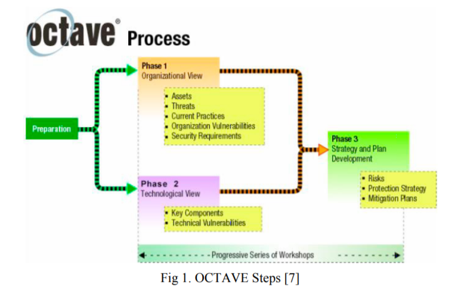
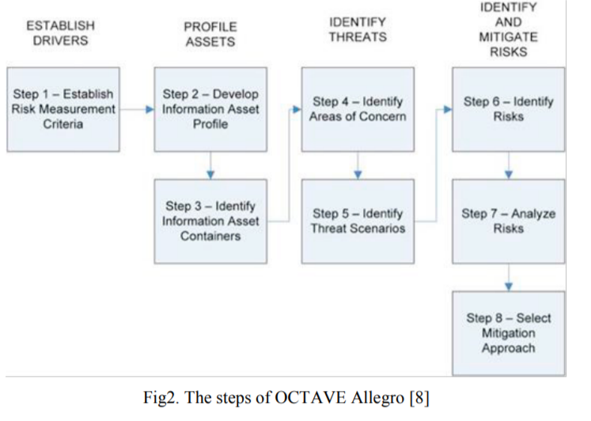
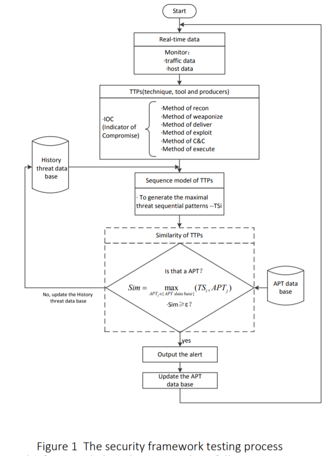
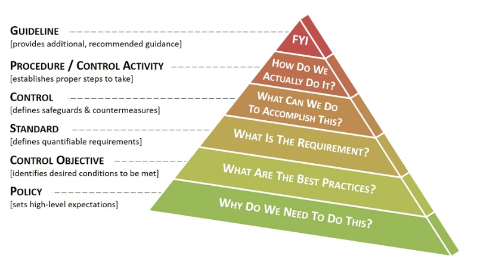

# Readings

## A Survey on Advanced Persistent Threats: Techniques, Solutions, Challenges, and Research Opportunities (2019)

Alshamrani A, Myneni S, Chowdhary A, Huang D.(2019) A Survey on Advanced Persistent Threats: Techniques, Solutions, Challenges, and Research Opportunities. IEEE Communications Surveys & Tutorials. 2019;21(2):1851-1877. [https://doi.org/10.1109/COMST.2019.2891891](https://doi.org/10.1109/COMST.2019.2891891). [Survey_APT_Techniques_Solutions_Challenges.pdf](Survey_APT_Techniques_Solutions_Challenges.pdf).

> Advanced Persistent Threats are threats that involve determined and persistent well-funded attackers with goals to gain crucial data or impede critical components of their target organization or government. Unlike targeted attacks, these attacks involve use of sophisticated tools and/or techniques.

An advanced persistent threat (APT) differs from a targeted attack (TA), because the APT seeks to maintain control within the system for a sustained period of time often for months or even years at a time.  These APT attacks also tend to be well-funded organizations that can leverage multiple assaults over a prolonged campaign.

### What are the stages of an APT campaign

- **Stage 1: Reconnaissance** - Reconnaissance marks the beginning of any successful attack. The more attackers understand about the target, the higher their rate of success.
- **Stage 2: Establish Foothold** - This stage represents the attackers’ successful entry into their target’s computer and/or computer network. In order to achieve their goal they need to establish a foothold in the target’s network.
- **Stage 3: Lateral Movement/Stay Undetected** - If the attackers’ goal is to undermine critical components or to steal organizational data, they would need to laterally move within the target’s network in search of those components or data.
- **Stage 4: Exfiltration/Impediment** - When the attackers’ goal is to get organizational data, actions comprising retrieving and sending this data to the attackers’ command and control center fall under this stage. In addition, when the attackers’ goal is to undermine critical components, actions comprising disabling or destroying the critical components of that target organization will fall under this stage.
- **Stage 5: Post-Exfiltration/Post-Impediment** - This stage involves post-exfiltration/post-impediment activities such as continuing to exfiltrate or disable more critical components or delete evidence for a clean exit from the organization’s network.

### What is an attack tree

An attack tree forms a graph of AND/OR gates that need to occur before moving to the next objective.  This approach gives a formal model of the sequences of events that must occur for the APT to be accomplish their mission.  There are multiple attack vectors possible against each gate and the attacker needs only needs a small number (e.g., one) to succeed.

### What campaigns are involved

### What defense strategies were involved

### What is moving target defense (MTD)

A colleciton of strategies exist for preventing APT by introducing entropy.  For instance, if the attacker uses a service account perhaps changing its password breaks that path.  Other instances target broader dynamic infrastruture scenarios.

## Advanced Social Engineering Attacks (2015)

Krombholz, K., Hobel, H., Huber, M., & Weippl, E. (2015). Advanced social engineering attacks. Journal of Information Security and Applications Volume 22, June 2015, Pages 113-122. [https://doi.org/10.1016/j.jisa.2014.09.005](https://doi.org/10.1016/j.jisa.2014.09.005). [advanced_social_engineering_attacks.pdf](advanced_social_engineering_attacks.pdf)

Social engineering encompasses strategies for manipulating humans into performing actions on our behalf.  For instance, if you can get them to run a script, click a link or bypass process, then the end result is an elevation of priviledge.  The attacker is able to perform some action in a secondary security context and thus system integrity breaks down.  In the context of APT this is an efficient mechnaism for getting on to the network, versus bruteforcing the firewall or hoping to discover some zero-day attack.

## Surviving advanced persistent threats in a distributed environment - Architecture and analysis (2015)

Mehresh, Ruchika, and Shambhu Upadhyaya. 2015. “Surviving Advanced Persistent Threats in a Distributed Environment - Architecture and Analysis.” Information Systems Frontiers 17 (5): 987. [https://search-ebscohost-com.proxy1.ncu.edu/login.aspx?direct=true&db=edb&AN=109474409&site=eds-live](https://search-ebscohost-com.proxy1.ncu.edu/login.aspx?direct=true&db=edb&AN=109474409&site=eds-live). [Surviving_APT.pdf](Surviving_APT.pdf)

The authors describe a system for detecting and responding to APT in a stealthy manner.  It seems that a lot of their technology centers around ensuring critical resources cannot be tampered.  They accomplish this feat by storing signatures in Trusted Platform Module (TPM) modules and then provisioning several replicas.  If a coordinator detects that a replica is in an erroneous state, then it can stop accepting messages from that instance.

The solution encounters roughly 10% communication overhead due to the RSA encryption operations that need to validate each message.

### Why are honey pots ineffective

They state that using HoneyPots/Nets is not an effective strategy because these are less effective against APT -- which are less likely to fall for the trap.  When they do fall for it, this might raise an alert but the attackers can laterally move across the network to continue evading discover (e.g., jump to a different workstation).

### Why are IDS systems ineffective

Many IDS monitoring systems run as user mode processes, and this makes them vulnerable to various attacks.  More advanced systems rely on either kernel mode structures or Trusted Platform Module (TPM) to hold various signatures.  TripWire is discussed as being in the middle with signatures stored in TPM but periodically verifying those values as a user mode process.

## Assessment of information system risk management with OCTAVE Allegro at Education Institution (2018)

Suroso, J. S., & Fakhrozi, M. A. (2018). Assessment of information system risk management with Octave Allegro at Education Institution. Procedia Computer Science Volume 135, 2018, Pages 202-213. [https://doi.org/10.1016/j.procs.2018.08.167](https://doi.org/10.1016/j.procs.2018.08.167). [Assess_Risk_OctaveAllegro.pdf](Assess_Risk_OctaveAllegro.pdf).

OCTAVE (Operationally Critical Threat, Asset, and Vulnerability Evaluation) is a methodology used to identify and evaluate information security risks. The use of OCTAVE itself is intended to help the company in terms of:

- Develop a qualitative risk evaluation criteria that describe the company's operational risk tolerance
- Identify the assets that are important to the company's mission
- Identify vulnerabilities and threats to those assets
- Determine and evaluate the possible consequences for the company if the threat occurred.

### What are the steps of OCTAVE

## A study on security framework against advanced persistent threat (2017)

Zhang Q, Li H, Hu J. A study on security framework against advanced persistent threat. 2017 7th IEEE International Conference on Electronics Information and Emergency Communication (ICEIEC), Electronics Information and Emergency Communication (ICEIEC), 2017 7th IEEE International Conference on. July 2017:128-131. [https://doi.org/10.1109/ICEIEC.2017.8076527](https://doi.org/10.1109/ICEIEC.2017.8076527). [SecurityFramework_APT.pdf](SecurityFramework_APT.pdf)

The authors propose a system that relies on OpenIOC (Indicators of Compromoise), an XML-based data exchange format for sharing threat information.  According to [this video](https://youtu.be/BH_k_0yNpRA) these messages contain AND/OR predicates that describe malware or an attack or whatever.

Tooling can generate these signatures for intrusion detection systems to detect APT.

## Policy vs Standard vs Control vs Procedure (2020)

Compliance Forge (2020). Policy vs Standard vs Control vs Procedure. [https://www.complianceforge.com/word-crimes/policy-vs-standard-vs-control-vs-procedure](https://www.complianceforge.com/word-crimes/policy-vs-standard-vs-control-vs-procedure). [Policies_vs_Standards.pdf](Policies_vs_Standards.pdf).

The author provide a comparison of different aspects of a policy document and articulate differences between the good, bad, and ugly.

This information is directly useful for the second part of the assignment.

## Cyber Security Lifecycle (2017)

Sadgune, R; Sadgune, A (2017). Cyber Security Lifecycle. HackForLab. [https://hackforlab.com/cyber-security-lifecycle/](https://hackforlab.com/cyber-security-lifecycle/).  Accessed Date 6/1/2020. [security_lifecycle.pdf](security_lifecycle.pdf).

The author propose a feedback loop that includes steps:

- Identify: Determine which threats exists against what resources
- Protect: Apply risk mitigation strategies for those systems
- Detect: Provision systems that look for failures and erroneous behaviors
- Respond: Execute indicident response workflows to determine next steps
- Recover: Delivering on the response strategy and confirm the incident is resolved
- Repeat: Given these new threats identify other areas of concern

## Palo Alto Network - Security Lifecycle Review (SLR)(2018)

Westcon-Comstor(2018). Palo Alto Network - Security Lifecycle Review. YouTube. Accessed 6/21/2020. [https://youtu.be/agf1BdOHmMI](https://youtu.be/agf1BdOHmMI).

Palo Alto approaches SLR by examining the network traffic, employee behavior, vulnerability assessment, threats, and high risk operations.  This information feeds into a comprehensive report that can be prioritized and implemented.
