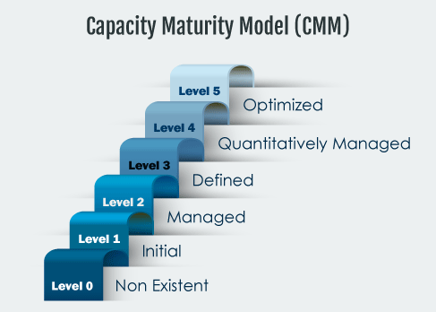

# Control Structure for Secure Database and Software Development

In this ever-evolving cyber-environment, where attackers are becoming more and more skilled, more sensitive corporate data is moved to the cloud, either because of applications updated or transitioned to web-based, mobile solutions or because of mandates of law—as is the case of electronic health record implementation. Security implementation and infrastructure are fundamental aspects every organization must handle carefully, especially over the cloud. Fault tolerance methods must be carefully implemented when handling massive data, and you must integrate conventional storage solutions like physical hard drives with solid-state, virtual storage solutions on a secured environment, and/or encryption algorithms.

Now that operating systems and applications have more lines of code, a methodology for code design and routine programming must be set to avoid holes or vulnerabilities in code that could later be exploited.

Enterprise resource planning (ERP) and service-oriented architecture (SOA) solutions, as well as enterprise software solutions, are examples of software solutions that are complex or hard to manage because of their database size, module integration, transactions or views, and user authorization role matrix. While enhancing integration between processes, the complexity associated with large solutions makes IT integration and telecommunications and IT architecture requirements harder to achieve and manage in a framework of control and security. Both ERP and SOA have been designed to adapt and easily integrate new devices, databases, scripts, or applications. While it is a great benefit from a user point of view, it also presents challenges to IT and security personnel in terms of ensuring this integration happens in a controlled environment and does not present vulnerabilities to the installation.

Because of the complexity of today’s IT operations landscape, it is critical to follow a framework or model where all naming standards, project management guidelines, documentation minimum requirements and database configuration, management, and data transmission controls are stated and enforced to all solution architects and designers. Among these standards, we can mention control objectives for information technology (COBIT), supervisory control and data acquisition (SCADA) systems, information technology infrastructure library (ITIL), open web application security project (OWASP), and capacity maturity model (CMM) and others.

As part of the IT landscape management framework it is essential to establish naming standards for network nodes, database and program naming standards, secure coding best practices, and protection algorithms for files or reports to be transmitted over the cloud or saved in remote storage devices. All steps of the information processing cycle must be secured. The risk management process uses these standards to assess potential risks and strengthen these standards.

The systems development lifecycle (SDLC) consists of a series of phases comprised of tasks and activities completed when deliverables are submitted to mark milestone completion following an established methodology. Sample deliverables are reports, matrix charts, or files. Among the basic stages of the SDLC are:

- Initial Assessment or Request - Understand the problem, issue, request, requirement, or opportunity
- Current Operational Environment (As-Is)
- Requirements Determination
- Proposed Solution Design
- Construction, Application Coding, Database Schema Design, Network Installation
- Testing and Documentation
- Training
- Implementation and Software Deployment
- Maintenance

As applications are developed following a phased approach or an agile approach to project management, variations are also followed for database and application design. It is important that network and database administrators keep diagrams and technical documentation up to date and backed-up for reference, to protect corporate information technology knowledge, and in case of any contingency. As part of the risk assessment and risk management process, the maturity of systems is evaluated and classified following the capacity maturity level (CMM).

As more systems are integrated into the information technology landscape, the risk management process needs to be integrated into each step of the systems and application development process. By doing so, it will be possible to proactively assess and prevent damage or intrusions that can damage systems integrity or normal state of operations.

Review the resources listed below (and previously provided resources, as needed) to prepare for this week’s assignments. The resources may include textbook reading assignments, journal articles, websites, links to tools or software, videos, handouts, rubrics, etc.
