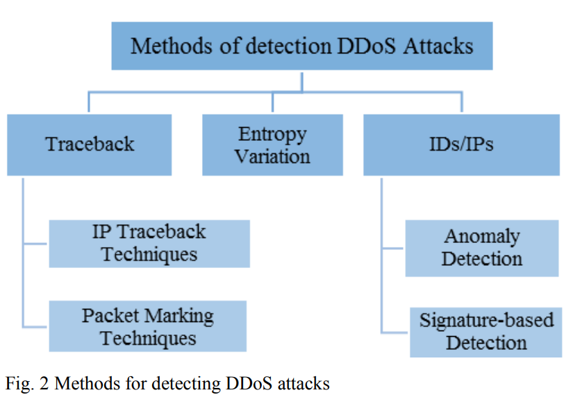
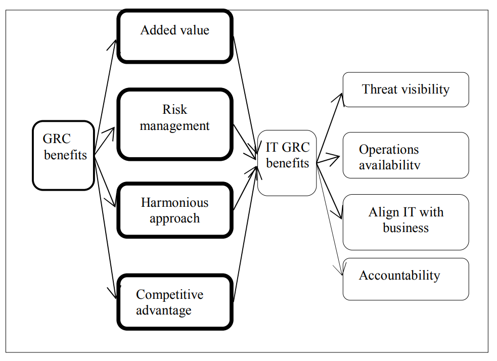
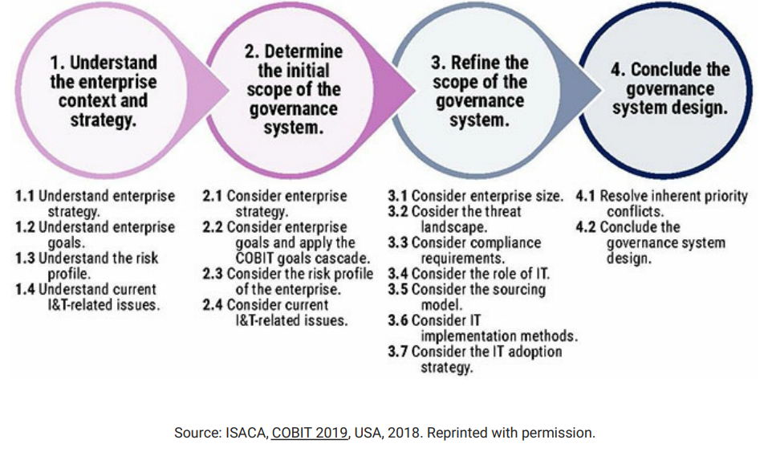
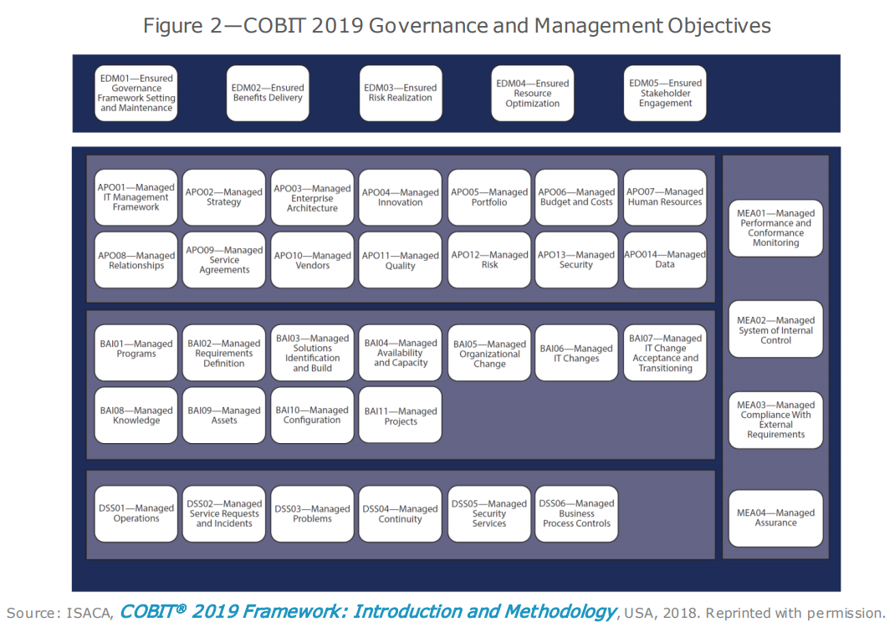

# Readings

## New Approach to Determine DDoS Attack Patterns on SCADA System Using Machine Learning (2019)

Al-Haidari, Fahd & AL-Dahasi, Ezaz. (2019). New Approach to Determine DDoS Attack Patterns on SCADA System Using Machine Learning. 1-6. [https://doi.org/10.1109/ICCISci.2019.8716432](https://doi.org/10.1109/ICCISci.2019.8716432). [DDoS_Scada.pdf](DDoS_Scada.pdf).

The authors use the [KDDCup'99 dataset](http://kdd.ics.uci.edu/databases/kddcup99/kddcup99.html) for comparison between J48 (decision trees), Naive Bayes, and Random Forests classifications.  Their objective is to detect DDoS attacks for both high and low rate scenarios.  This is accomplished by having two filters:

- Metric 1: Average Filter (high rate)
- Metric 2: [Discrete Fourier Transform](https://en.wikipedia.org/wiki/Discrete_Fourier_transform) (low rate)

### What features did they use

From the [available features](http://kdd.ics.uci.edu/databases/kddcup99/kddcup.names) they used:

|Variable No| Features|
|-----------|---------|
|1 Duration|
|2 |Protocol_type|
|3 |Service|
|4 |Flag|
|5 |Src_bytes|
|6 |Dst_bytes|
|7 |Land|
|8 |Wrong_fragment|
|9 |Logged_in|
|10| Count|
|11| Srv_Count|
|12| Dst_Host_Count|
|13| Dst_Host_Srv_Count|
|14| Dst_Host_Same_Source_Port_Rate|
|15| Attack|

## Designing your organization's custom COBIT (2019)

Grijp, S. (2019, March 4). Designing your organization's custom COBIT. COBIT Focus, 1–3. [https://search-ebscohost-com.proxy1.ncu.edu/login.aspx?direct=true&db=bth&AN=135182096&site=ehost-live](https://search-ebscohost-com.proxy1.ncu.edu/login.aspx?direct=true&db=bth&AN=135182096&site=ehost-live). [Custom_COBIT.pdf](Custom_COBIT.pdf).

The author mostly repeats the content of COBIT_Design and adds a notion of numerial scoring to each domain { Low=1, Normal=2, High=3} that expresses compliance.

## Random network coding for secure packet transmission in SCADA networks (2018)

Nazir, S., & Kaleem, M. (2018). Random network coding for secure packet transmission in SCADA networks. 2018 3rd International Conference on Emerging Trends in Engineering, Sciences and Technology (ICEEST), Emerging Trends in Engineering, Sciences and Technology (ICEEST), 2018 3rd International Conference On, 1–4. Karachi, Pakistan, Pakistan. [https://doi-org.proxy1.ncu.edu/10.1109/ICEEST.2018.8643329](https://doi-org.proxy1.ncu.edu/10.1109/ICEEST.2018.8643329). [SecurePacketTransmission_SCADA.pdf](SecurePacketTransmission_SCADA.pdf).

Most SCADA systems are built with the assumption that the network is trusted, and therefore do not require encryption to protect its communication.  One of the challenges with adding encryption after the fact is that SCADA must operate as a real-time system and is highly sensitive to delays.  The authors propose a mechanism for XOR encoding messages for adding a fast layer to hide `modbus protoecol commands`.  

### What critism exists for this approach

While they discuss the value here, other providers such as Amazon Nitro Operating Systems (aka AWS) avoid these issues by offloading the crypto algorithms to dedicated hardware.  The enterprise would need to choose which costing is more critical to the business and if they are willing to accept the additional attack surface of simple XOR messages. 

Another challenge is that it lacks details on the key exhange protocol, stating that the keys start with a preshared key but then change the key at each message.  How does that process remain secure, since the initial message from each system must be reused OR include some known offset (e.g. shared clock) making this security by obsurity.  Whatever the mechanism might be, the obsurity would need to be documented for interop scenarios and thus many challenges with this solution in practice.

## Managing Information Security Risk Using Integrated Governance Risk and Compliance (2017)

Nicho, M., Khan, S., & Rahman, M. S. M. K. (2017). Managing Information Security Risk Using Integrated Governance Risk and Compliance. 2017 International Conference on Computer and Applications (ICCA), Computer and Applications (ICCA), 2017 International Conference On, 56–66. Doha, United Arab Emirates, United Arab Emirates. [https://doi-org.proxy1.ncu.edu/10.1109/COMAPP.2017.8079741](https://doi-org.proxy1.ncu.edu/10.1109/COMAPP.2017.8079741). [IntegratedGovernanceRiskCompliance.pdf](IntegratedGovernanceRiskCompliance.pdf).

The authors conducted open interviews across multiple years to build a model for guiding managerial decisions.  When management considers governance, risk, and compliance the resulting outcomes are more fault tolerant and secure.  These are not new concepts though they have traditionally been fragmented into different silos and not accounted for in a holistic unified solution. 

## COBIT Design Factors: A Dynamic Approach to Tailoring Governance in the Era of Digital Disruption (2019)

Rafeq, Abdul (2019, February 4). COBIT Focus. p1-6. 6p. [https://eds-b-ebscohost-com.proxy1.ncu.edu/eds/pdfviewer/pdfviewer?vid=1&sid=4f3fc652-db5c-4e6e-968a-ab8809af0d76%40sessionmgr103](https://eds-b-ebscohost-com.proxy1.ncu.edu/eds/pdfviewer/pdfviewer?vid=1&sid=4f3fc652-db5c-4e6e-968a-ab8809af0d76%40sessionmgr103).  [COBIT_Design.pdf](COBIT_Design.pdf).

COBIT is a general framework of best practices that can be applied to any enterprise.  This approach is important because all enterprise cultures are different, and its not possible to have a one size fits all solution.  When deciding how to implement COBIT within an organizaiton its useful to consider dimensions:

- Enterprise Strategy
- Enterprise Goals
- Risk profile
- Enterprise Size
- Threat Landscape
- Compliance Requirement
- Role of IT
- Sourcing Model of IT
- IT Implementation Methods
- Technology Adaption Strategy
- Future Factors

## Intelligent software platform and end-point software for risk management (2018)

A. Senkov, "Intelligent Software Platform and End-Point Software for Risk Management," 2018 International Multi-Conference on Industrial Engineering and Modern Technologies (FarEastCon), Vladivostok, 2018, pp. 1-5, [https://doi.org/10.1109/FarEastCon.2018.8602702](https://doi.org/10.1109/FarEastCon.2018.8602702). [IntelligentPlatform_EndpointSoftware.pdf](IntelligentPlatform_EndpointSoftware.pdf).

## A New COBIT Is in Town and I Really Like How It Looks (2018)

Thomas M. A New COBIT Is in Town and I Really Like How It Looks. COBIT Focus. December 2018:1-8. [https://search-ebscohost-com.proxy1.ncu.edu/login.aspx?direct=true&db=bth&AN=133592800&site=eds-live](https://search-ebscohost-com.proxy1.ncu.edu/login.aspx?direct=true&db=bth&AN=133592800&site=eds-live). Accessed June 27, 2020. [New_COBIT.pdf](New_COBIT.pdf).

COBIT v5 is the version that previous material in this class and [TIM-8301 CyberSecurity](https://github.com/dr-natetorious/TIM-8301-Principals_of_CyberSecurity) make reference toward.  However, in 2019 the next iteration was released under the creative name of `COBIT 2019`.  Now governance components include the following list:

- Processes
- Organizational structures
- Information flows and items
- People, skills and competencies
- Culture, ethics and behavior
- Policies and procedures
- Services, infrastructure and applications

These components differ from the former `enablers`, as it was challenging to directly associate them with business activity.  The new model `governance components` instead more closely aligns with the structure of enterprise environments.  A detailed collection of tables maps these enablers to components and provides links to additional details.

