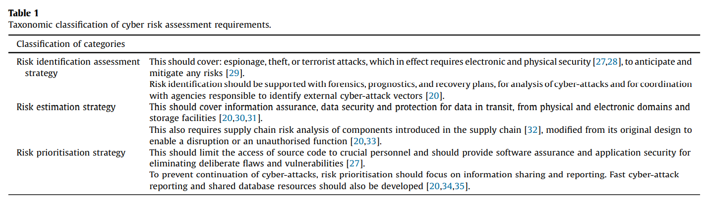

# Readings

## What are the actual costs of cyber risk events (2018)

Eling, M; Wirfs, J (2018). What are the actual costs of cyber risk events. European Journal of Operational Research
Volume 272, Issue 3, 1 February 2019, Pages 1109-1119. [https://doi.org/10.1016/j.ejor.2018.07.021](https://doi.org/10.1016/j.ejor.2018.07.021). [ActualCostCyberRiskEvents.pdf](ActualCostCyberRiskEvents.pdf).

This article was previously discussed in [TIM-8301 Cybersecurity Week5](https://github.com/dr-natetorious/TIM-8301-Principals_of_CyberSecurity/blob/master/Week5_AppraiseRisk/Readings/README.md).  Please visit that section for a more detailed analysis.

The TLDR here is that companies underestimate the likelihood and cost of an incident, in part due to limited reliable information sharing across the industry.

## Managing Cyber-risks (2016)

Johnson, K (2016). Managing Cyber Risks. Georgia Law Review. Winter2016, Vol. 50 Issue 2, p547-592. 46p. [https://search-ebscohost-com.proxy1.ncu.edu/login.aspx?direct=true&db=a9h&AN=117006390&site=eds-live](https://search-ebscohost-com.proxy1.ncu.edu/login.aspx?direct=true&db=a9h&AN=117006390&site=eds-live). [ManageCyberRisk.pdf](ManageCyberRisk.pdf).

Cyberrisk dominates the discussions around risk-management because it costs enterprises billions annually and excites the imagination of readers and victims alike.  While there is some skeptisim that these malicious attacks will eventually compromise the national economy, the _absense of evidence, is not the evidence of absense_.  Organizations ned to `approach these real-time threats with systemtic responses`.

> The term risk is used colloquially to suggest th at an action or decision may lead to a negative outcome. In truth, risk taking
may lead to either a positive or negative outcome. Risk simply describes an elem ent of uncertainty or the chance for a range of
possible outcomes. (pg. 556)

One underrated challenge is systemic risk, which occurs when the underlying fabric of the system is disrupted.  For instance, during the onset of the COVID-19 pandemic all assets dropped in value.  Even assets that are typically inversely correlated such equities and gold both fell, perhaps liquidating quality assets to pay-off bad bets.  Many small caps that failed to hedge or transfer that risk have since gone bankrupt.

### What is the influence of systematic risk

> It is widely agreed that systemic risk refers to a trigger event, such as an economic shock or institutional failure,
[that] causes a chain of bad economic consequences—sometimes referred to as a domino effect. (pg. 560)

The origin of systemic risk can vary greatly depending on the business model of the organization. For example, an online broker has significant exposure to their mobile being compromised versus an algorithmic trading firm risks insider threats.

However, this view might be too narrow and misrepresent the influence of external factors.  Consider the algorithmic trading app which is based on machine learning decisions.  As previously discussed during [TIM-8301 Cybersecurity](https://github.com/dr-natetorious/TIM-8301-Principals_of_CyberSecurity) and [TIM-8130 Data Mining](https://github.com/dr-natetorious/TIM-8130-Data_Mining) -- ML is inheriently insecure.  Analyst focus on _can they predict, is the input legit_ resulting in a surge attacks against DeepLearning systems.

An potential scenario might involve a competitor triggering erroneous state in the algorithmic platform (e.g., large buy/sells in illiquid market).  This situtation is similar to the root cause of [Mt. Gox's bankruptcy](https://www.wired.com/2014/03/bitcoin-exchange/).

### What challenges exist from regulation

As previously discussed at length in [TIM-8301 Cybersecurity](https://github.com/dr-natetorious/TIM-8301-Principals_of_CyberSecurity), there is significant disparity between the legal expectations at local, state, national, and international levels.  While there is a consensus that more information sharing would _be a tide that raises all ships_, the incentives do not exist equal participation.  "Why would I present my business in a bad light, if nothing requires my competitor to do the same?"

> There have been some efforts like the `Cybersecurity Information Sharing Act of 2015` that invites private entities to gather and share relevant cybersecurity threat information with federal agencies or private entities without concerns th at such acts violate antitrust
regulations or create liability.

With the ability to anonymously distribute attack signatures businesses are more likely to participate.  Though there are risks to customer privacy that automated signature collection might include sensitive information, such as the filename `c:\docs\upcoming_smith_jones_merge.docx`.  Organizations that are part of the sharing ring also do not gain additional value by showing there cards, thus the incentives to listen not participate continue to exist.

### How should we approach systematic risk

The authors evangalize the idea of stress tests using:

- Policy reviews
- Financial models (e.g., Value at Risk (VAR))
- Governance and control processes (e.g., COBIT)
- Processes that promote disclosure and transparency

## Future developments in cyber risk assessment for the internet of things (2018)

Radanliev, P., De Roure, D.C., Nicolescu, R., Huth, M., Mantilla, R., Cannaly, S., & Burnap, P. (2018). Future developments in cyber risk assessment for the internet of things. Computers in Industry Volume 102, November 2018, Pages 14-22. [https://doi.org/10.1016/j.compind.2018.08.002](https://doi.org/10.1016/j.compind.2018.08.002). [FutureRisksIoT.pdf](FutureRisksIoT.pdf).

Cyber-risks are known to exist across cyber-physical systems (CPS) like IoT devices and other connected devices, however there is little consideration how those challenges should be assessed.  Vulnerabilities in these devices present unique situtations that differ from more traditional protection schemes.  The authors propose a model that examines the 'vertical integration' to determine potential risks at the systematic level.

