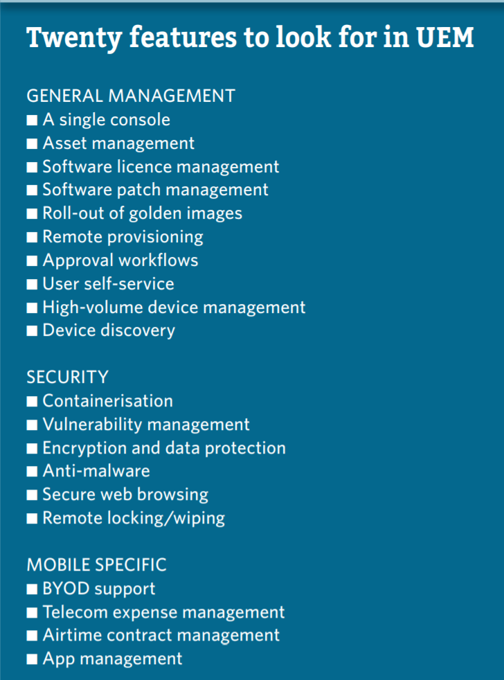

# Mobile Device Management (MDM)

Businesses adopt MDM solutions to increase their security posture across mobile devices, with protections including patch management, device configuration, and remote wipe scenarios (AT&T, 2018).

AT&T Business (2018). What is Mobile Device Management.  AT&T Business Services. [https://www.youtube.com/watch?v=Cq6cg8S7q1M](https://www.youtube.com/watch?v=Cq6cg8S7q1M).

## The Value of Unified Endpoint Management (2018)

Tarzey B. The Value of Unified Endpoint Management. Computer Weekly. August 2018:16. [https://search-ebscohost-com.proxy1.ncu.edu/login.aspx?direct=true&db=edb&AN=131123396&site=eds-live](https://search-ebscohost-com.proxy1.ncu.edu/login.aspx?direct=true&db=edb&AN=131123396&site=eds-live). Accessed July 18, 2020.[ValueUnifiedEndpointManagement.pdf](ValueUnifiedEndpointManagement.pdf)

Legacy device management encounters numerous challenges due to variability to system design, requiring administrators to use a variety of tools or standardize the enterprise on a one-size-fits-some single product line.While this strategy was not ideal it became impossible with the evolution of BYOD, which saw employees insist on personalized equipment.

Unified Endpoint Management (UEM) addresses these issues by creating an abstraction layer that can translate corporate governance and policies into device specific configurations.  For instance, the administrator can state that all critical operating system patches must be installed.  While the implementation of this action varies between Windows desktops, Apple iPhones, and Android Chromebooks-- the intent does not.

## What tooling is available

| Manufacturer | Product | Description|Strengths|Weaknesses|
|--------------|---------|------------|---------|----------|
| Microsoft| Azure Intune| Azure Based solution that manages 100M+ devices all shapes and sizes|Tight integration into Microsoft ecosystem (e.g., ConfigMgr)|No ChromeOs or 3rd party identity support|
| MobileIron| Unified Endpoint Management | Cloud solution for segmenting and protecting corp data on personal devices|High quality support|Inconsistent release schedules and slowing vendor support|
| IBM| Enterprise Mobility Management| Integration for MaaS360 with Watson| Lots of templates and SaaS make easy to get started | MaaS360 has limited international availability|
| VMWare| Workspace ONE| AirLift platform has strong focus on migrating from legacy client management to UEM|Partnership with Microsoft.  Device Compliance focus| Requires purchasing virtualization and UEM licenses|

- Soseman, M (2019). Intune for Mobile Device Management. Agile IT. [https://www.youtube.com/watch?v=00T5A1qj18E](https://www.youtube.com/watch?v=00T5A1qj18E).
- MobileIron (2020). How does MobileIron Work. MobileIron. [https://youtu.be/xTe6lFL4Cek](https://youtu.be/xTe6lFL4Cek).
- Chris Silva, Manjunath Bhat, Rich Doheny, Rob Smith (2019). Magic Quadrant for Unified Endpoint Management Tools. Gartner. [https://www.gartner.com/doc/reprints?id=1-1ODRVFHP&ct=190812&st=sb](https://www.gartner.com/doc/reprints?id=1-1ODRVFHP&ct=190812&st=sb). [Gartner_UnifiedEndpointManagement.pdf](Gartner_UnifiedEndpointManagement.pdf).

## Risks from Mobile Device Management

ERM Initative Faculty (2014). Managing Risks of the Mobile Enterprise. NC State: Enterprise Risk Management Initiative. [https://erm.ncsu.edu/library/article/manage-risks-mobile-enterprise](https://erm.ncsu.edu/library/article/manage-risks-mobile-enterprise). [ManagingRisks_MobileEnterprise.pdf](ManagingRisks_MobileEnterprise.pdf).

- Stolen Device
- Mobile Malware
- Advanced Threats
- Software Vulnerabilities
- End-user Behavior
- Compliance and Legal

Yamin, M; Katt, B (2019). Mobile device management (MDM) technologies, issues and challenges. In Proceedings of the 3rd International Conference on Cryptography, Security and Privacy (ICCSP ’19). Association for Computing Machinery, New York, NY, USA, 143–147. [https://doi.org/10.1145/3309074.3309103](https://doi.org/10.1145/3309074.3309103). [MobileDev_Tech_Issues_Challenges.pdf](MobileDev_Tech_Issues_Challenges.pdf).

- Network access controls
- Centralized log management may contain PII
- Patch management
- Containerization and segmentation
- End-user privacy risks (e.g., GPS and sensor data)
- International businesses risk policies violating device owners rights/privacy due to inconsistent regulation (e.g., GDPR vs China vs US vs Delware)

## Frameworks for approaching mobile security and privacy

Jackson, N.; Walshe, P. (2013). Accountability Framework for the implementation of the GSMA Privacy Design Guidelines for Mobile App Development. Global System for Mobile Communications Association. [https://www.gsma.com/publicpolicy/wp-content/uploads/2013/01/Accountability-framework-final.pdf](https://www.gsma.com/publicpolicy/wp-content/uploads/2013/01/Accountability-framework-final.pdf). [GSMA_MobilePrivacy.pdf](GSMA_MobilePrivacy.pdf).

> The five elements of accountability outlined by the Center for Information Policy and Leadership (CIPL) are considered as a good starting point to build a robust accountability framework. These five elements are common
in other proposals and business practices and include:

1. Organisational commitment to accountability and adoption of internal policies (consistent with the Guidelines).
2. Mechanisms to put privacy policies into effect, including tools, training and education. 
3. Systems for internal, ongoing oversight and assurance reviews (and external facing verification).
4. Transparency and mechanisms for individual participation.
5. Means for remediation and enforcement.
