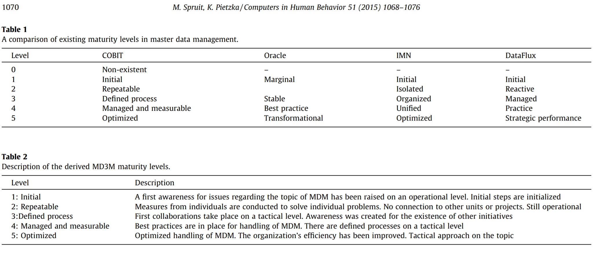
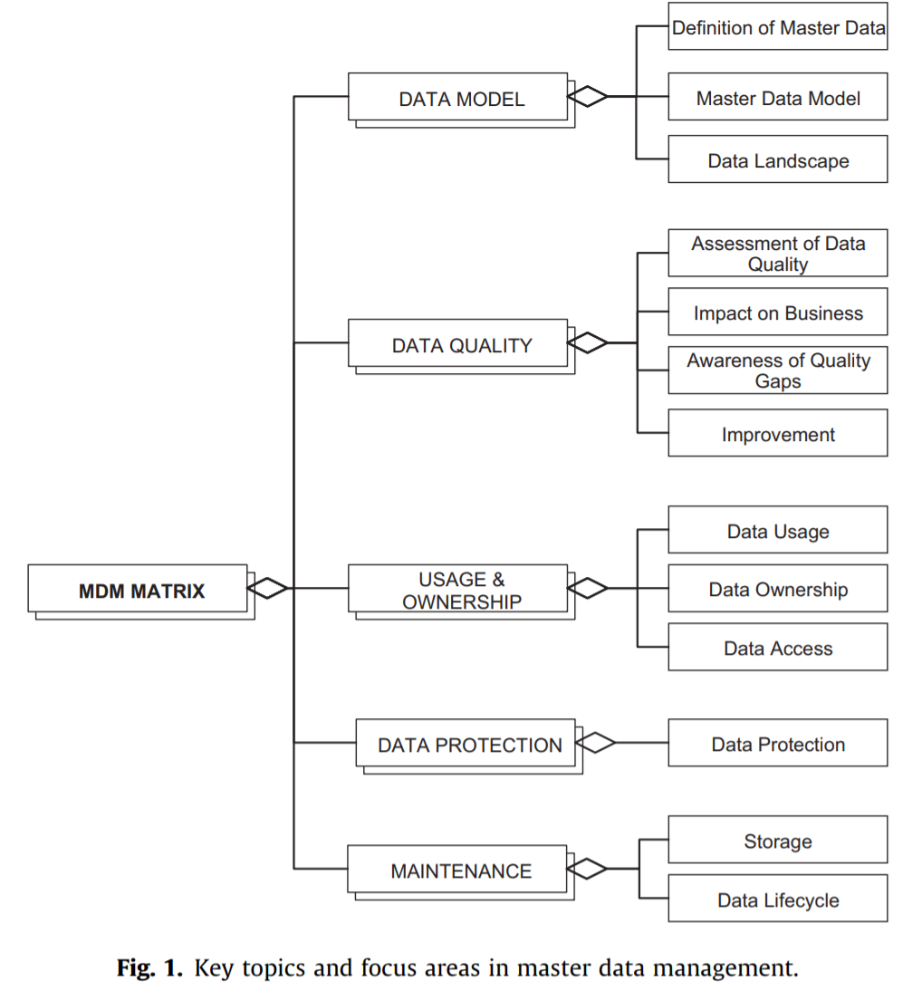

# Readings

## Examining the importance of data governance in healthcare (2018)

Fuller, S. (2018). Examining the importance of data governance in healthcare. Journal of AHIMA, 89(10), 42–44. [https://search-ebscohost-com.proxy1.ncu.edu/login.aspx?direct=true&db=ccm&AN=132280045](https://search-ebscohost-com.proxy1.ncu.edu/login.aspx?direct=true&db=ccm&AN=132280045). [GovernanceHealthcare.pdf](GovernanceHealthcare.pdf).

Traditional data governance relies on protecting information within an application, then devising a seperate collection of controls for another program.  One of the challenges with this segmented model is that it results in numerous seams and cracks between the systems.  The authors propose that instead, a modern governance solution must evaluate the holistic lifecycle of the information across the ecosystem.

## Incremental checking of Master Data Management model based on contextual graphs (2015)

Lamolle M, Menet L, Le Duc C. Incremental checking of Master Data Management model based on contextual graphs. Enterprise Information Systems. 2015;9(7):681-708. [https://doi.org/10.1080/17517575.2013.792395](https://doi.org/10.1080/17517575.2013.792395). [IncrementalCheckingMasterData.pdf](IncrementalCheckingMasterData.pdf).

Ensuring proper controls around data lifecycle is complex when those controls must span various technology stacks.  Further complicating matters are mobile device management (MDM) and bring your own device (BYOD) situtations as the system administrators (e.g., random employee) and data administrators (e.g., IT staff) are different people.  The data administrators can _create governance but not force policies_ on these platforms, resulting is gaps in the management strategies.

> Within the framework of interoperability of heterogeneous data sources, there are two main data integration approaches: the virtual approach (or mediator) (Lenzerini 2002) and the materialised approach (or data warehouse).

The corporate governance teams can model these risks using various levels of abstractions.  However, there are challenges with explaining universal model due to platform specific design differences.  There are several approaches to mitigating these issues, such as bubbling up to broad definitions of expectations, then using providers to translate these ideas into workable implementations.

After building these models and their various levels of compliance assertions, there are challenges verifying the model.  Traditional solutions rely on recursively walking the tree to evaluate the response.  Unfortunately, in most enterprise and industrial environments the tree becomes too large to efficiently recalculate on a regular basis.  Alternatively, the authors propose several strategies that use incremental updates to refresh only the relevant subgraphs as various events request these updates.

## A master data management solution to unlock the value of big infrastructure data for smart, sustainable and resilient city planning (2017)

Ng, S.T., Xu, F. G., Yang, Y., & Lu, M. (2017). A master data management solution to unlock the value of big infrastructure data for smart, sustainable and resilient city planning. Procedia Engineering Volume 196, 2017, Pages 939-947. [https://doi.org/10.1016/j.proeng.2017.08.034](https://doi.org/10.1016/j.proeng.2017.08.034). [MDM_BigInfra.pdf](MDM_BigInfra.pdf).

Many metropolitan areas are investing heavily in smart city technologies and IoT deployments.  While it is relatively simple to create an individual system (e.g., smart street lights), challenges incorporating these ideas across the verticle and horizontal landscapes exist.  These issues occur because sharing information is across heterogeneous domains is inheritently complex.  Similar ideas are discussed in [TIM-7010: Networking and Mobile: Week 7](https://github.com/dr-natetorious/TIM-7010-Computer_Networks_and_Mobile_Computing/tree/master/Section_4_Application/Week7_Darpa_SmartCity).

## Privacy Behaviors After Snowden (2015)

Preibusch S (2015). Privacy Behaviors After Snowden. Communications of the ACM. 2015;58(5):48-55. [https://doi.org:10.1145/2663341](https://doi.org:10.1145/2663341). [PrivacyAfterSnowden.pdf](PrivacyAfterSnowden.pdf).

PRISM Day, June 6th, 2013, is the point that mainstream media began discussing the Snowden leaks about the National Security Administration (NSA) program to spy on globl internet communications.  Using a collection of search engine query trend analysis, the authors examine the longitudinal influence across the American.  There was initially a spike in interest that degrades over the following weeks.  Other stories such as the Royal Baby took over the limelight, and pushed these storys into the background.  However, there is a measurable influence of focus on corporate privacy statements suggesting that its not entirely forgotten. 

## Towards a service architecture for master data exchange (2017)

Rivas, B., Merino, J. Caballero, I., Serrano, M., & Pattini, M. (2017). Towards a service architecture for master data exchange based on ISO 8000 with support to process large datasets. Computer Standards & Interfaces Volume 54, Part 2, November 2017, Pages 94-104. [https://doi.org/10.1016/j.csi.2016.10.004](https://doi.org/10.1016/j.csi.2016.10.004). [ServiceArchMasterDataExchange.pdf](ServiceArchMasterDataExchange.pdf).

Master Data Management ([MDM](https://en.wikipedia.org/wiki/Master_data_management)) refers to the situtations that arise from collections of artifacts being copied to third-party systems.  For instance, corporate email begins life on the SMTP hosts, then downloads onto the (a) employees mobile devices and (b) partner networks.  This creates challenges around data governance and insuring `the integrity of the organization's communication`.

### What challenges exist to MDM integrity

Risks across the confidentiality, integrity, and availability (CIA) triad exist; and their associated threats and vulnerabilities minimized.  For instance, mobile devices can become lost and expose `confidential` information.  The `integrity` of shared data sets becomes challenging as version changes occur, and replication strategies need to update all third-parties.  Information that is not `availabile` has no value during a decision process, causing partners and employees to lack competitive insights.

### What is ISO 8000: Data Quality and Enterprise Master Data

The [ISO standard](https://eccma.org/iso-8000/) defines common vocabulary, processes, and measurements for compliance of data portability.  When data is not portable, then it must run within a specific application context and is therefore subject to those applications license restrictions.  These restrictions pervert the notion of "my data" and resulting in simply "application data."

When systems are free to use information however they see fit, it provides extensibility and the necesssary fuel for Web 4.0 scenarios (e.g., 5G, smart cities, IIoT, ...).

### How do we build an MDM solution

> In [4](https://books.google.com/books?hl=en&lr=&id=GEaUoHtJ1b8C&oi=fnd&pg=PP1&ots=ykIBPprvZp&sig=JPw9BiO80N_nL0bPcL0lV802CCs#v=onepage&q&f=false), Master Data is defined as those concepts that determine the basic knowledge of the business domain in which one an organization develops its business activity. Thus, the organizations that need to exchange Master Data for the execution of some of their business processes should refer to equivalent concepts represented by coherent versions of Master Data. Moreover, it is important to manage properly the quality values of the exchanged Master Data.

Part 110: includes the requirement to build the master data messages:

1. Adherence to a formal syntax
2. Semantic encoding
3. Conformance to data specification
4. Business model

## MD3M: The master data management maturity model (2015)

Spruit, M., & Pietzka, K. (2015). MD3M: The master data management maturity model. Computers in Human Behavior, 51(B), 1068-1076. [https://doi.org/10.1016/j.chb.2014.09.030](https://doi.org/10.1016/j.chb.2014.09.030). [MasterDataMaturityModel.pdf](MasterDataMaturityModel.pdf).

Master Data Management (MDM), which we define as "the management of the consistent and uniform subset of business
entities that describe the core activities of an enterprise."  These entities must be shared across business processes in a consistent and reliable manner.  When these procedures do not occur, then it results in missed opportunities.

The authors propose a collection of dimensions and scores that enable the business to quantify the current level of maturity of these MDM systems.  Since the model relies on a faceted mechanism the administrators can drill into specific subsections that are lacking, and build targeted controls to improve those specific aspects.

### What aspects feed into these maturity levels

The authors propose that a business consider the following dimensions of its MDM solution.  Each aspect can be evaluated on a scale between initial (1) through optimized (5) to grade the maturity level.  Then performing a weighted average of each segment results in a net ecosystem score.  Businesses can use this information to focus on specific improvement opportunities over generalize/broad methods of attack. 

