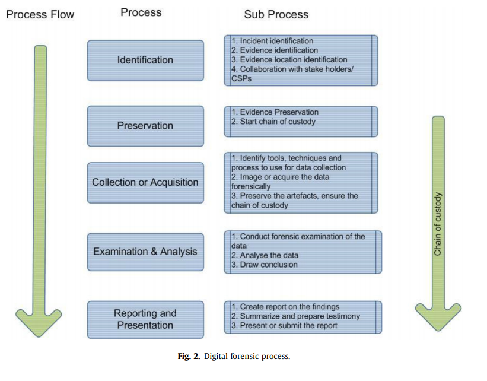

# Readings

## A conceptual framework for integrated information privacy protection (2016)

Abdullah H; Labuschagne L; Young J (2016). A conceptual framework for integrated information privacy protection. 2016 International Conference on Advances in Computing and Communication Engineering (ICACCE), Advances in Computing and Communication Engineering (ICACCE), 2016 International Conference on. November 2016:242-248. [https://doi.org/10.1109/ICACCE.2016.8073755](https://doi.org/10.1109/ICACCE.2016.8073755). [Integrated_Info_Privacy.pdf](Integrated_Info_Privacy.pdf).

Governance, risk and compliance (GRC) _is an integrated approach overseeing people, processes and technology in order to deliver stakeholder value while managing risk and complying with regulations and laws_.

## Four ethical issues of the information age (1986)

R. O. Mason, "Four ethical issues of the information age," MIS Quarterly, vol. 10, pp. 5-12, 1986. 
Mason, Richard. (1986). Four Ethical Issues of the Information Age. Management Information Systems Quarterly - MISQ. 10. [https://doi.org/10.2307/248873](https://doi.org/10.2307/248873). [Four_Ethical_Issues_of_the_Information_Age.pdf](Four_Ethical_Issues_of_the_Information_Age.pdf).

In 1986, espoused that the Information Age would lead to four major concerns regarding the use of information, namely, privacy, accuracy, property and accessibility (PAPA).

## Security in cloud computing (2015)

Ali, M.; Khan, S. U.; Vasilakos, A. V. (2015, June 1). Security in cloud computing: Opportunities and challenges. Information Science, Volume 305, 1 June 2015, Pages 357-383. [https://doi.org/10.1016/j.ins.2015.01.025](https://doi.org/10.1016/j.ins.2015.01.025). [SecurityCloudComputing.pdf](SecurityCloudComputing.pdf).

There are many opportunities that come from the cloud, however, some businesses are reluctant to trust these environments entirely.  These concerns come from the multi-tenant nature, among other issues.  The authors provide an extensive survey of challenges and modern solutions.

### How do we address these challenges

The literature review consistenty proposes the use of VLAN, IDS/IPS, and firewalls to protect data in transit.  These tools should pair with virtual devices that use secure hypervisors for seperation.

Essentially, these products are leading to the idea of functionality and process isolation.  If an operation is within its own bubble, then that becomes the blast radius.  When data must leave that bubble, controls need to AAA those requests and enforce CIA during the operation.

## Governance practices and critical success factors suitable for business information security (2015)

Bobbert Y; Mulder H (2015). Governance practices and critical success factors suitable for business information security. 2015 International Conference on Computational Intelligence and Communication Networks (CICN), Computational Intelligence and Communication Networks (CICN), 2015 International Conference on, Computational Intelligence and Communication Networks, International Conference on. December 2015:1097-1104. [https://doi.org/10.1109/CICN.2015.216](https://doi.org/10.1109/CICN.2015.216). [GovernancePractices.pdf](GovernancePractices.pdf).

Failures with information security impact ask aspects of the business, and this makes `Business Security` an issue for all members of the organization.  Many companies address these issues by only focusing on cybersecurity technological controls such as firewalls and antivirus.  However, it is also important to include `governance controls` through policies, continuity planning, and legal compliance.  

As more stakeholder perspectives come into consideration, the solution becomes more mature and holistic across  _people, processes, and products against both negligent and malicious sources_.

## The Role of Intelligence in Corporate Security (2018)

Brennan, J. J. (2018). The Role of Intelligence in Corporate Security. Security: Solutions for Enterprise Security Leaders, 55(4), 22. [https://search-ebscohost-com.proxy1.ncu.edu/login.aspx?direct=true&db=bth&AN=128773504&site=eds-live](https://search-ebscohost-com.proxy1.ncu.edu/login.aspx?direct=true&db=bth&AN=128773504&site=eds-live). [Intelligence_CorpSec.pdf](Intelligence_CorpSec.pdf).

This short article discusses the challenges of organizations keeping pace with the evolving threat intelligence, and then staffing appropriately.  The author calls out the need for experts in the following areas:

- Emerging Cyberthreats
- Geo-political risks
- Due diligence
- Competitive information
- Counter intelligence

## Information security governance: pending legal responsibilities of non-executive boards (2017)

Georg, L. (2017). Information security governance: pending legal responsibilities of non-executive boards. Journal of Management & Governance, 21(4), 793–814. [https://doi-org.proxy1.ncu.edu/10.1007/s10997-016-9358-0](https://doi-org.proxy1.ncu.edu/10.1007/s10997-016-9358-0). [LegalResponsibilities.pdf](LegalResponsibilities.pdf).

While executive leadership has access to security threat assessments, the minors often lack these insights and this creates gaps in the risk management strategy.  Instead, governance policies must exist to convey the challenges and general approach to non-executives, so they can align their personal role with the corporate solution.

> Boards that choose to ignore, or minimize, the importance of cyber security oversight responsibility, do so at their own peril. SEC Commissioner Luis A. Aguilar, June 10, 2014.

Non-executive memebers lack the incentives to understand these risks, because the impact is indirect and more impactful toward their employer.  In contrast, executives are personally liable for `breach of fiduciary duty` and will be removed from office.  However, these incentives do not tell the entire story "with 2/3 of officers briefed at most annually (pg. 795)." `Essentially, corporate governance is lacking at all levels of the organization`.

> My starting hypothesis is as following: There is a structural conflict of interest at the non-executive board level between the reporting of security risks and the riskbased supervision of risk mitigation in the area of information security. This may also lead to legal aberrations. At the end, a better knowledge of legislation will lead to a better judgment of information security and hence to manage operational risks that conflict on non-executive board level against improving strategic control in corporate governance (pg. 796).

These ideas touch on previous concepts of aligning the incentives to extract the desired outcome.  If we do not train staff members, how can we expect them to operate in the best interests of the business?  People follow the path of least resistence to accomplish their job, and systems need to exist to make that route ideal through risk awareness.

> Ahrens’ call to adjust the research frontier in corporate governance resulted from his conclusion that current corporate governance research has failed to address the real risk—which became apparent in the financial crisis (Ahrens et al. 2011). While corporate governance research is encouraged to move more towards the area of value creation (Huse et al. 2011), operational risk management and in particular information security governance are focusing mainly on the entrepreneurial versus control aspect in research but require just as much attention to avoid further gaps in risk management.

This section aligns with Bobbert & Mulder (2015) above, where businesses focus too heavily on delivering innovation and traditional blunt instrument approaches to risk management.  Alternatively, governance programs must introduce notions of ethical, regulatory, and compliance norms-- that install a deeper understanding of risk mitigation.

## Risk Management for Information Security of Corporate Information Systems Using Cloud Technology (2018)

Kozlov, A. D., & Noga, N. L. (2018). Risk Management for Information Security of Corporate Information Systems Using Cloud Technology. 2018 Eleventh International Conference “Management of Large-Scale System Development” (MLSD, Management of Large-Scale System Development (MLSD), 2018 Eleventh International Conference, 1–5. [https://doi-org.proxy1.ncu.edu/10.1109/MLSD.2018.8551947](https://doi-org.proxy1.ncu.edu/10.1109/MLSD.2018.8551947). [RiskMgmtCloudTech.pdf](RiskMgmtCloudTech.pdf).

Businesses that can produce the most using the least resources are more competitive, and these cost savings can come at odds with security other best practices.  Some leaders believe that its not economically possible to remove every risk so, there's no point in prioritizing these efforts.  However, this finite budget instead should promote the idea of finding the most critical and impactful items first.

### How can fuzzy logic help prioritization

The authors propose clustering threats into different prioritized buckets, using fuzzy logic.  Fuzzy logic applies the function `belonging(item,set) => [0..1]`  to determine the probability membership.  Then using discrete mathematics and set theory the results can be union, intersect, etc.

This article calculates the belonging score by calculating the impact of a given resource in terms of probability scores across `(confidentiality, integrity, availability)`--  used as `belonging(...) => max(c,i,a)`.  The probabilities might originate from a custom model (e.g., Expected value) or general solution like the  _Common Vulnerability Scoring System General vulnerability assessment system_.

> It should be noted that there are many different methods of information security risk analysis both at the  qualitative level, for example, OCTAVE, FRAP, and in quantitative terms, for example, Risk Watch, as well as in the mixed version, for example, CRAMM or Microsoft (pg. 4).

## Cloud forensics: Technical challenges, solutions and comparative analysis (2015)

Pichan, A., Lazarescu, M., & Soh, S. T. (2015, June). Cloud forensics: Technical challenges, solutions and comparative analysis. Digital Investigation Volume 13, June 2015, Pages 38-57. [https://doi.org/10.1016/j.diin.2015.03.002](https://doi.org/10.1016/j.diin.2015.03.002). [CloudForensics.pdf](CloudForensics.pdf).

As companies migrate into the cloud, they bring their vulnerabilities and software defects with them. When criminals exploit these threats it can be challenging to investigate, due to the infrastructure belonging to third-party providers.  These criminals can also leverage free-trial on those providers to launch attacks and then disappear into the ether.

Many service providers offer tooling to audit AAA operations across the platform, though it can be tedious to map across these different tools such as API Grants (e.g., AWS CloudTrail) and network logs (e.g., VPN Flowlog).  These issues can be compounded by the dynamic nature of the cloud, with virtual resources transitioning between various physical assets.

### What are standard forensic process models

> Different researchers have been refining previously published process and framework and proposing new ones, resulting in a variety of digital forensic process models and terminology. A selected number of digital forensic process models are:

1. Digital Investigative Process (DIP) model proposed by the first Digital Forensic Research Conference Workshop
(DFRWS) comprising of (i) identification (ii) preservation (iii) Collection (iv) Examination (v) Analysis (vi) Presentation phases (Palmer, 2001).
2. McKemmish model, comprising of a linear process of (i) identification (ii) preservation (iii) Analysis and (iv) presentation phases (McKemmish, 1999).
3. NIST Forensic model consisting of (i) Collection, (ii) Examination, (iii) Analysis and Reporting phases (Kent et al., 2006).
4. Integrated Digital Forensic Process Model (IDFPM) that consists of (i) preparation, (ii) incident, (iii) incident
response, (iv) physical investigation, (v) digital forensic investigation and (vi) presentation. In this model the authors propose a uniform process, a common terminology and standardized digital forensic process model (Kohn et al., 2013).
5. Digital Forensic Analysis Cycle Model that consists of (i) Commence (scope), (ii) Prepare and Respond, (iii) Identify and Collect, (iv) Preserve (Forensic Copy), (v) Analyze, (vi) Present, (vi) Feedback, and (vii) Complete or Further Task identified phases. This is a cyclic and iterative model (Quick and Choo, 2013).
6. Integrated Conceptual Digital Forensic Framework for cloud computing that consists of (i) Evidence source identification and preservation, (ii) Collection, (iii) Examination and analysis, and (iv) Reporting and Presentation
phases (Martini and Choo, 2012).

